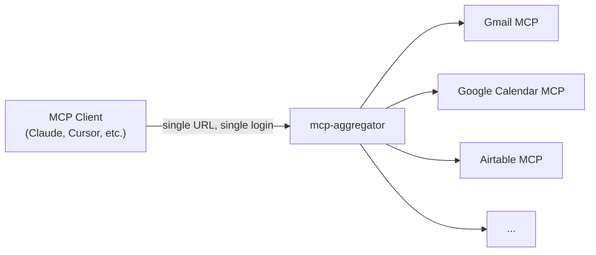

# mcp-aggregator

> Save your and your team's time configuring [MCP servers](https://modelcontextprotocol.io/) in every client — set up a single endpoint that combines all your MCPs behind one login.

If you run several remote MCP servers (e.g. [Gmail](https://github.com/domdomegg/gmail-mcp), [Google Calendar](https://github.com/domdomegg/google-cal-mcp), [Airtable](https://github.com/domdomegg/airtable-mcp-server) via [mcp-auth-wrapper](https://github.com/domdomegg/mcp-auth-wrapper)) and multiple MCP clients (e.g. Claude.ai, Claude Code, VS Code), every client needs to be configured with each server separately. Add a new server? Update every client. Want your team to use the same set of tools? Configure each person's machine.

mcp-aggregator solves this: you configure your upstream servers once, then point all your MCP clients at one URL. When a user connects, they log in via your existing identity provider (Google Workspace, Microsoft Entra ID, Okta, Auth0, Keycloak, etc.). The aggregator then presents them with every tool from every upstream, namespaced and ready to use (e.g. `gmail__send_email`, `calendar__create_event`). If an upstream requires its own OAuth (like a Google API), the user is prompted to authorize it on first use — the aggregator stores and refreshes those tokens automatically from then on.



Under the hood, mcp-aggregator exposes a [streamable HTTP](https://modelcontextprotocol.io/specification/2025-06-18/basic/transports#streamable-http) endpoint with [OAuth 2.1](https://modelcontextprotocol.io/specification/2025-06-18/basic/authorization) authentication. Tools from all upstreams are namespaced and served through a single `/mcp` endpoint. Per-user upstream OAuth tokens are stored in SQLite. All auth state is stateless (encrypted sealed tokens), so there's no session database to manage.

## Usage

Set `MCP_AGGREGATOR_CONFIG` to a JSON config object and run:

```bash
MCP_AGGREGATOR_CONFIG='{
  "auth": {"issuer": "https://auth.example.com"},
  "upstreams": [
    {"name": "gmail", "url": "https://gmail-mcp.example.com/mcp"},
    {"name": "calendar", "url": "https://calendar-mcp.example.com/mcp"}
  ]
}' npx -y mcp-aggregator
```

This starts an HTTP MCP server on localhost:3000. When a user connects, they'll be redirected to your login provider. After logging in, they can use tools from all configured upstreams. If an upstream requires its own OAuth, the user is prompted to authorize on first use.

<details>
<summary>Other configuration methods</summary>

The env var can also point to a file path:

```bash
MCP_AGGREGATOR_CONFIG=/path/to/config.json npx -y mcp-aggregator
```

Or create `mcp-aggregator.config.json` in the working directory — it's picked up automatically:

```bash
npx -y mcp-aggregator
```

</details>

<details>
<summary>Running with Docker</summary>

```bash
docker run -e 'MCP_AGGREGATOR_CONFIG={"auth":{"issuer":"...","clientId":"..."},"upstreams":[...]}' -p 3000:3000 ghcr.io/domdomegg/mcp-aggregator
```

</details>

### Config

Only `auth.issuer` and `upstreams` are required. Everything else has sensible defaults.

| Field | Required | Description |
|-------|----------|-------------|
| `auth.issuer` | Yes | Your login provider's URL. Must support [OpenID Connect discovery](https://openid.net/specs/openid-connect-discovery-1_0.html). |
| `auth.clientId` | No | Client ID registered with your login provider. Defaults to `"mcp-aggregator"`. |
| `auth.clientSecret` | No | Client secret. Omit for public clients. |
| `auth.scopes` | No | Scopes to request during login. Defaults to `["openid"]`. |
| `auth.userClaim` | No | Which field from the login token identifies the user. Defaults to `"sub"`. |
| `upstreams[].name` | Yes | Namespace prefix for tools (e.g. `"gmail"`). |
| `upstreams[].url` | Yes | Streamable HTTP endpoint URL. |
| `storage` | No | Where to store per-user upstream tokens: `"memory"` (default) or a SQLite file path. |
| `port` | No | Port to listen on. Defaults to `3000`. |
| `host` | No | Host to bind to. Defaults to `"0.0.0.0"`. |
| `issuerUrl` | No | Public URL of this server. Required when behind a reverse proxy. |
| `secret` | No | Signing key for tokens. Random if not set. Set a fixed value to survive restarts. |
| `discoveryTimeout` | No | Timeout for upstream discovery/connect in ms. Defaults to `5000`. |
| `toolTimeout` | No | Timeout for upstream tool calls in ms. Defaults to `60000`. |

A full example:

```json
{
  "auth": {
    "issuer": "https://keycloak.example.com/realms/myrealm",
    "clientId": "mcp-aggregator",
    "clientSecret": "optional-secret",
    "scopes": ["openid"],
    "userClaim": "sub"
  },
  "upstreams": [
    { "name": "gmail", "url": "https://gmail-mcp.example.com/mcp" },
    { "name": "calendar", "url": "https://calendar-mcp.example.com/mcp" }
  ],
  "storage": "/data/aggregator.sqlite",
  "port": 3000,
  "host": "0.0.0.0",
  "issuerUrl": "https://mcp.example.com",
  "secret": "some-persistent-secret",
  "discoveryTimeout": 5000,
  "toolTimeout": 60000
}
```

### Login provider examples

<details>
<summary>Google Workspace</summary>

```json
{
  "auth": {
    "issuer": "https://accounts.google.com",
    "clientId": "...",
    "clientSecret": "..."
  },
  "upstreams": [
    {"name": "gmail", "url": "https://gmail-mcp.example.com/mcp"}
  ]
}
```

Create OAuth 2.0 credentials in the [Google Cloud Console](https://console.cloud.google.com/apis/credentials). Choose "Web application", add `https://<host>/callback` as an authorized redirect URI. To restrict access to your organization, configure the OAuth consent screen as "Internal".

</details>

<details>
<summary>Microsoft Entra ID</summary>

```json
{
  "auth": {
    "issuer": "https://login.microsoftonline.com/<tenant-id>/v2.0",
    "clientId": "...",
    "clientSecret": "..."
  },
  "upstreams": [
    {"name": "gmail", "url": "https://gmail-mcp.example.com/mcp"}
  ]
}
```

Register an application in the [Azure portal](https://portal.azure.com/#view/Microsoft_AAD_RegisteredApps). Add `https://<host>/callback` as a redirect URI under "Web". Create a client secret under "Certificates & secrets". Replace `<tenant-id>` with your directory (tenant) ID.

</details>

<details>
<summary>Okta</summary>

```json
{
  "auth": {
    "issuer": "https://your-org.okta.com",
    "clientId": "...",
    "clientSecret": "..."
  },
  "upstreams": [
    {"name": "gmail", "url": "https://gmail-mcp.example.com/mcp"}
  ]
}
```

Create a Web Application in Okta. Set the sign-in redirect URI to `https://<host>/callback`. The issuer URL is your Okta org URL (or a custom authorization server URL if you use one).

</details>

<details>
<summary>Keycloak</summary>

```json
{
  "auth": {
    "issuer": "https://keycloak.example.com/realms/myrealm",
    "clientSecret": "..."
  },
  "upstreams": [
    {"name": "gmail", "url": "https://gmail-mcp.example.com/mcp"}
  ]
}
```

Create an OpenID Connect client in your Keycloak realm with client ID `mcp-aggregator` (or set `auth.clientId` to match). Set the redirect URI to `https://<host>/callback`. Users are identified by `sub` (Keycloak user ID) by default. Set `auth.userClaim` to `preferred_username` to match by username instead.

</details>

<details>
<summary>Auth0</summary>

```json
{
  "auth": {
    "issuer": "https://your-tenant.auth0.com",
    "clientId": "...",
    "clientSecret": "..."
  },
  "upstreams": [
    {"name": "gmail", "url": "https://gmail-mcp.example.com/mcp"}
  ]
}
```

Create a Regular Web Application in Auth0. Add `https://<host>/callback` as an allowed callback URL. Set `auth.clientId` to the Auth0 application's client ID. The `sub` claim in Auth0 is typically prefixed with the connection type (e.g. `auth0|abc123`).

</details>

<details>
<summary>Authentik</summary>

```json
{
  "auth": {
    "issuer": "https://authentik.example.com/application/o/myapp/",
    "clientSecret": "...",
    "userClaim": "preferred_username"
  },
  "upstreams": [
    {"name": "gmail", "url": "https://gmail-mcp.example.com/mcp"}
  ]
}
```

Create an OAuth2/OpenID Provider in Authentik with client ID `mcp-aggregator` (or set `auth.clientId` to match). Set the redirect URI to `https://<host>/callback`.

</details>

<details>
<summary>Home Assistant (via hass-oidc-provider)</summary>

Home Assistant doesn't natively support OpenID Connect. Use [hass-oidc-provider](https://github.com/domdomegg/hass-oidc-provider) to bridge the gap — it runs alongside Home Assistant and adds the missing pieces.

```json
{
  "auth": {
    "issuer": "https://hass-oidc-provider.example.com"
  },
  "upstreams": [
    {"name": "gmail", "url": "https://gmail-mcp.example.com/mcp"}
  ]
}
```

Point `auth.issuer` at your hass-oidc-provider instance (not Home Assistant directly). The `sub` claim is the Home Assistant user ID. No `clientId` or `clientSecret` needed.

</details>

<details>
<summary>Advanced: scaling and persistence</summary>

All auth state (tokens, sessions, in-flight logins) is stateless — tokens are self-contained encrypted blobs and each request gets a fresh transport. Nothing is stored server-side except per-user upstream tokens (in `storage`).

To survive restarts, set `secret` to a fixed value and use a SQLite file for `storage`.

To run multiple instances behind a load balancer, set `secret` to the same value across instances and point `storage` at a shared SQLite file.

</details>

## Meta-tools

The gateway exposes two built-in tools:

- **`gateway__status`** — Shows all upstream servers and their authentication status. Returns auth URLs for servers that need per-user authentication.
- **`gateway__unauth`** — Removes stored authentication for an upstream server, allowing re-authentication.

## Contributing

Pull requests are welcomed on GitHub! To get started:

1. Install Git and Node.js
2. Clone the repository
3. Install dependencies with `npm install`
4. Run `npm run test` to run tests
5. Build with `npm run build`

## Releases

Versions follow the [semantic versioning spec](https://semver.org/).

To release:

1. Use `npm version <major | minor | patch>` to bump the version
2. Run `git push --follow-tags` to push with tags
3. Wait for GitHub Actions to publish to the NPM registry and GHCR (Docker).
